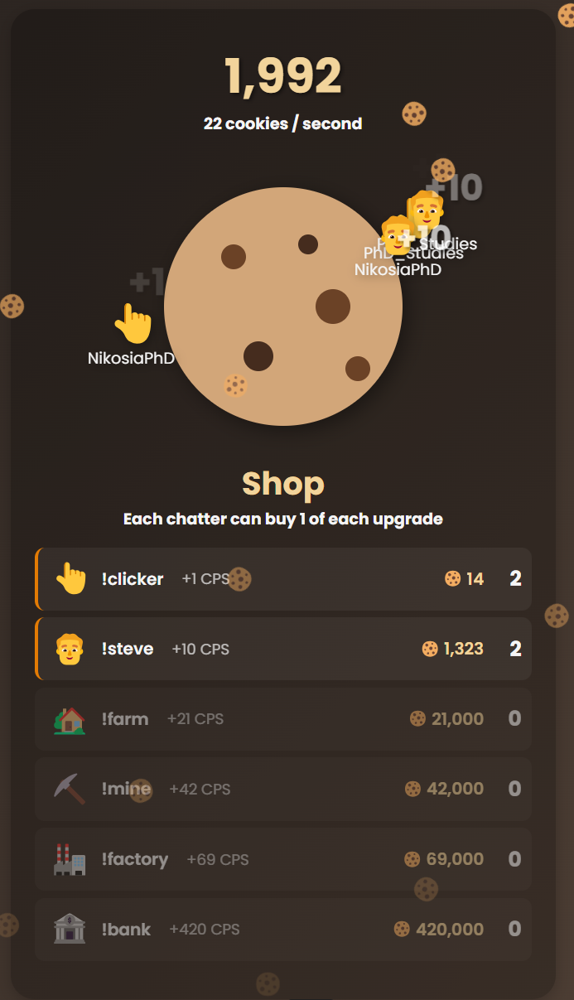

# Collective Cookie Clicker for Twitch Chat
Fun cooperative minigame for just chatting streams to keep Twitch chat engaged.





## Features
- Each Twitch chat message spawns a cookie (falling anywhere on screen)
- Each chatter can redeem each upgrade once
- Displaying the names of chatters next to their upgrades
- Many customization options in the settings  
- Easy setup in OBS


## How to Use in OBS
This is a lightweight, all-in-one HTML file.

1. Download `twitch-cookie-clicker.html`.
2. Edit settings in the file (see below) and save.
3. Open OBS.
4. Add a **Browser Source**.
5. Click the checkbox "Local File"
4. Browse and select the file where you saved it (The path should then be something like`file:///C:/Users/YourName/Downloads/twitch-cookie-clicker.html`)
5. Set the size to your streaming resolution (should work with any, tested with 1920x1080).

You can test that is works by typing a message in your offline chat.

**NOTE:** The game background is transparent; so whatever you put behind it in OBS will peek through (e.g., your usual starting-soon art)


## Editing Settings

Before using this in OBS you must edit the settings (at the very least set your channel name).

At the top of the `.html` file, you'll find a section that looks like this:

```js
// --- --- --- --- --- --- --- --- SETTINGS --- --- --- --- --- --- --- ---
// ONLY EDIT THE RIGHT SIDE OF THE EQUATION

// replace "nikosiaphd" with your twitch channel name
const CHANNEL_NAME = "nikosiaphd"

...

// AFTER THIS LINE YOU SHOULD NOT EDIT ANYTHING UNLESS YOU KNOW WHAT YOU'RE DOING
// --- --- --- --- --- --- --- --- --- --- --- --- --- --- --- --- --- ---
```

Edit these values as needed. Save the file and reload it in OBS ("Refresh Cache") to apply changes.


## Contact for Questions, Suggestions, etc.

You are free to use and modify this for your own stream. Instead of sharing the code with anyone ("redistribution"), refer them to this github repository. 

Feel free to contact me with suggestions or questions! Also check out my other projects that provide Twitch chat interactivity.

https://nikosiaphd.github.io


